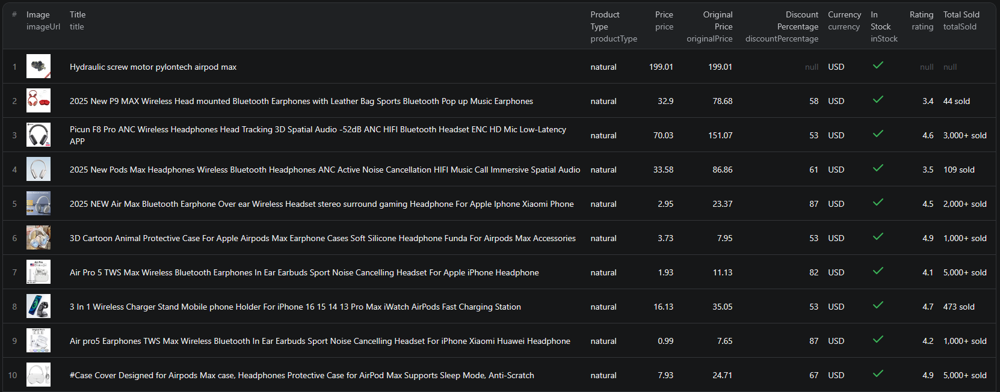

# How to Scrape AliExpress in Node.js

This example shows how to scrape AliExpress product listings in Node.js using the [AliExpress Listings Scraper](https://apify.com/piotrv1001/aliexpress-listings-scraper) actor on Apify — no browser automation or HTML parsing required.



## What this example does

- Calls the AliExpress Listings Scraper actor via the Apify API client
- Passes a list of AliExpress search URLs as input
- Waits for the actor run to finish
- Fetches results from the Apify dataset
- Prints each product listing to the console

## Prerequisites

- [Node.js](https://nodejs.org/) v18 or higher
- An [Apify account](https://console.apify.com/sign-up) (free tier available)
- An [Apify API token](https://console.apify.com/settings/integrations)

## Installation

```bash
npm install
```

## Environment setup

Copy `.env.example` to `.env` and add your Apify API token:

```bash
cp .env.example .env
```

Then open `.env` and replace `your_apify_token_here` with your actual token from [Apify Console → Settings → Integrations](https://console.apify.com/settings/integrations).

## Usage

```bash
npm start
```

The script will start an actor run, wait for it to complete, then print all scraped product listings to your console.

## Code example

```js
import { ApifyClient } from 'apify-client';
import 'dotenv/config';

// Initialize the ApifyClient with your Apify API token
// Set APIFY_TOKEN in your .env file (copy .env.example to get started)
const client = new ApifyClient({
    token: process.env.APIFY_TOKEN,
});

// Prepare Actor input
const input = {
    "searchUrls": [
        "https://www.aliexpress.us/w/wholesale-airpods-max.html?spm=a2g0o.home.search.0"
    ]
};

// Run the Actor and wait for it to finish
const run = await client.actor("piotrv1001/aliexpress-listings-scraper").call(input);

// Fetch and print Actor results from the run's dataset (if any)
console.log('Results from dataset');
console.log(`💾 Check your data here: https://console.apify.com/storage/datasets/${run.defaultDatasetId}`);
const { items } = await client.dataset(run.defaultDatasetId).listItems();
items.forEach((item) => {
    console.dir(item);
});

// 📚 Want to learn more 📖? Go to → https://docs.apify.com/api/client/js/docs
```

## Example output

See [`sample-output.json`](./sample-output.json) for a full example. Each product listing contains:

| Field | Description |
|---|---|
| `id` | AliExpress product ID |
| `title` | Full product title |
| `price` | Current price |
| `originalPrice` | Price before discount |
| `discountPercentage` | Discount amount (%) |
| `currency` | Currency code |
| `inStock` | Whether the item is available |
| `imageUrl` | Main product image URL |
| `additionalImages` | Array of additional image URLs |
| `rating` | Seller rating (0–5) |
| `totalSold` | Number of units sold |
| `store` | Store name, ID, and URL |
| `sellingPoints` | Highlights like "Free shipping" |

## Use cases

- **Price monitoring** — track AliExpress prices for specific product categories over time
- **Competitor research** — analyze which products are trending and how they are priced
- **E-commerce sourcing** — identify high-rated, discounted products for dropshipping or resale
- **Market research** — gather product data across multiple search queries for analysis
- **Deal discovery** — automatically find products with high discount percentages

## Try the actor on Apify

**[Open the AliExpress Listings Scraper on Apify](https://apify.com/piotrv1001/aliexpress-listings-scraper)**

Run it directly from the Apify Console with no code required, or integrate it into your own workflow using the API.

## Related resources

- [How to Scrape AliExpress Product Listings](https://www.falconscrape.com/blog/how-to-scrape-aliexpress-product-listings) — in-depth blog post covering AliExpress scraping strategies and use cases

## License

MIT
